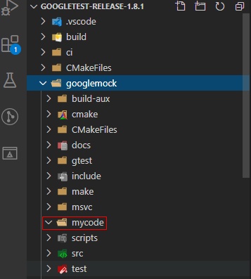
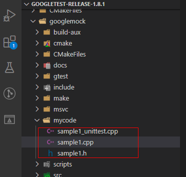
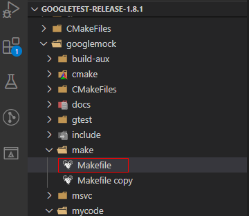
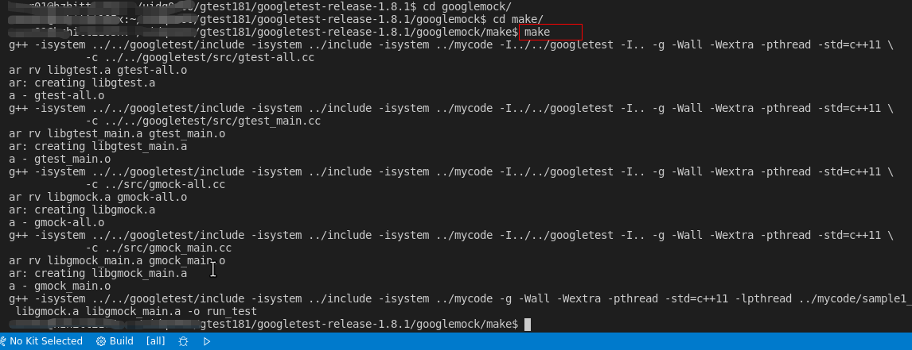
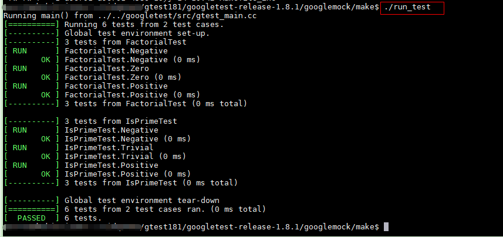

@[TOC](目录)

## 一、概述

在测试过程中，有些接口未实现，我们需要模拟这个接口，让调用这个接口的函数可以执行，这个时候我们就需要模拟（mock）这个接口。Google Test中有mock的框架（google mock，以后简称gmock），路径：   

    googletest-release-1.8.1/googlemock

为了后面项目使用的方便，建议直接在googlemock中进行编写单元测试，因为后面很多地方会使用到gmock（除非使用另外的mock框架）。


同时，为了以后项目编译方便，开始使用Makefile来管理项目的编译。

为方便Makefile文件编写和代码的编写，建议使用熟悉的编辑器，我这边使用Visual Studio Code进行编辑。


## 二、准备待测代码

我们使用googletest/samples下的sample1待测代码举例。

1. 首先，在googlemock文件夹下创建一个文件夹用于存放待测代码,如 mycode
   
   

2. 复制googletest/samples下的sample1.h、sample1.c、sample1_unittest.cc到googlemock/mycode目录下，并把".cc"后缀的文件改为".cpp",因为后续我测试的基本都是cpp的源码，把后缀改了，写Makefile文件按编译cpp文件来写，所以这里直接改了。
   
   这样待测代码就准备好了。

   

## 三、创建Makefile文件

接下来，我们修改Makefile文件，以编译测试代码并进行测试。自带的样例Makefile文件路径：

    googletest-release-1.8.1/googlemock/make/Makefile

备份一个后再创建一个新的Makefile。




创建的Makefile主要作用是遍历mycode待测源码目录，把所有源码加入编译，生成可执行文件run_test,编译成功后运行run_test即可执行测试。
Makefile的内容如下：
```c
GTEST_DIR = ../../googletest
GTEST_LIB_DIR = .
GMOCK_DIR = ..

USER_DIR = ../mycode

CPPFLAGS += -isystem $(GTEST_DIR)/include -isystem $(GMOCK_DIR)/include \
			-isystem $(GMOCK_DIR)/mycode/Mock -isystem $(GMOCK_DIR)/mycode/source/inc
CXXFLAGS += -g -Wall -Wextra -pthread -std=c++11
GTEST_LIBS = libgtest.a libgtest_main.a libgmock.a libgmock_main.a

# 最终生成的可执行文件的名称
TESTS = run_test 

GTEST_HEADERS = $(GTEST_DIR)/include/gtest/*.h \
                $(GTEST_DIR)/include/gtest/internal/*.h

GMOCK_HEADERS = $(GMOCK_DIR)/include/gmock/*.h \
                $(GMOCK_DIR)/include/gmock/internal/*.h \
                $(GTEST_HEADERS)

# 递归遍历mycode下的3级目录，如果源码目录更深，可以修改遍历层级
DIRS := $(shell find $(USER_DIR) -maxdepth 3 -type d)
# 展开所有文件
FILES = $(foreach d, $(DIRS), $(wildcard $(d)/*.cpp))
# 模式字符串替换函数patsubst
# 如$(patsubst %.c,%.o, a.c b.c)
# 把字串“a.c b.c”符合模式[%.c]的单词替换成[%.o]，返回结果是“a.o b.o”
OBJS = $(patsubst %.cpp, %.o, $(FILES))

all : $(GTEST_LIBS) $(TESTS)

clean :
	rm -f $(GTEST_LIBS) $(TESTS) *.o


GTEST_SRCS_ = $(GTEST_DIR)/src/*.cc $(GTEST_DIR)/src/*.h $(GTEST_HEADERS)
GMOCK_SRCS_ = $(GMOCK_DIR)/src/*.cc $(GMOCK_HEADERS)


gtest-all.o : $(GTEST_SRCS_)
	$(CXX) $(CPPFLAGS) -I$(GTEST_DIR) -I$(GMOCK_DIR) $(CXXFLAGS) \
            -c $(GTEST_DIR)/src/gtest-all.cc

gtest_main.o : $(GTEST_SRCS_)
	$(CXX) $(CPPFLAGS) -I$(GTEST_DIR) -I$(GMOCK_DIR) $(CXXFLAGS) \
            -c $(GTEST_DIR)/src/gtest_main.cc

gmock-all.o : $(GMOCK_SRCS_)
	$(CXX) $(CPPFLAGS) -I$(GTEST_DIR) -I$(GMOCK_DIR) $(CXXFLAGS) \
            -c $(GMOCK_DIR)/src/gmock-all.cc

gmock_main.o : $(GMOCK_SRCS_)
	$(CXX) $(CPPFLAGS) -I$(GTEST_DIR) -I$(GMOCK_DIR) $(CXXFLAGS) \
            -c $(GMOCK_DIR)/src/gmock_main.cc

libgtest.a : gtest-all.o
	$(AR) $(ARFLAGS) $@ $^

libgtest_main.a : gtest_main.o
	$(AR) $(ARFLAGS) $@ $^

libgmock.a : gmock-all.o
	$(AR) $(ARFLAGS) $@ $^

libgmock_main.a : gmock_main.o
	$(AR) $(ARFLAGS) $@ $^


%.o : %.cpp
	$(CXX) $(CPPFLAGS) $(CXXFLAGS) -c $< -o $@

$(TESTS) : $(OBJS) $(GTEST_LIBS)
	$(CXX) $(CPPFLAGS) $(CXXFLAGS) -lpthread $^ -o $@
```


## 四、编译执行

cd 进入googletest-release-1.8.1/googlemock/make/ 目录
执行make命令进行编译：

    make




最后执行如下命令执行所有测试：

    ./run_test




## 五、总结

在gmock框架下编译执行测试，目前我们还没有使用mock,后续使用到再学习怎么使用。

目前写了几篇笔记，基本都是初步的环境配置，样例的编译，接下来应该要开始实战了。

加油！看好你哦小伙子！

这个例子的源码暂时保存在git上使用如下命令即可下载：

    git clone git@github.com:TonsenWei/gtest_samples.git
    

或访问如下链接下载：
[gtest-demo](https://github.com/TonsenWei/gtest_samples/tree/V1.0.0)