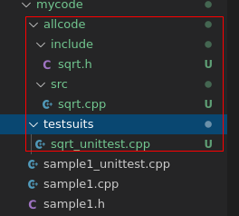
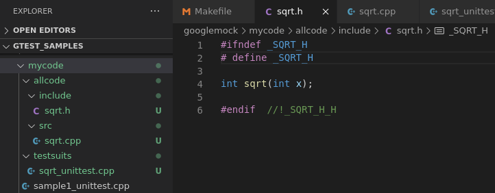
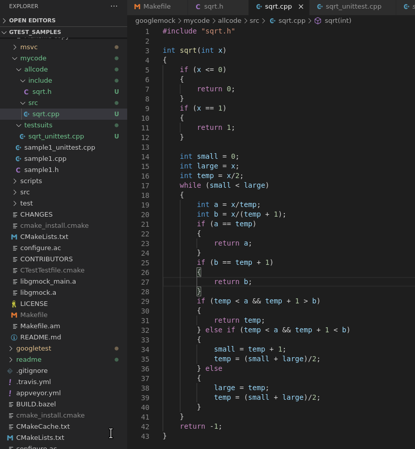
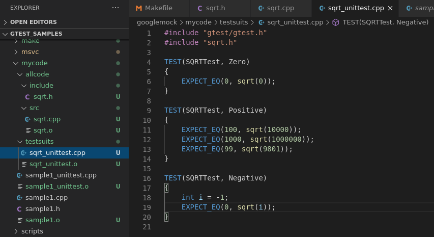
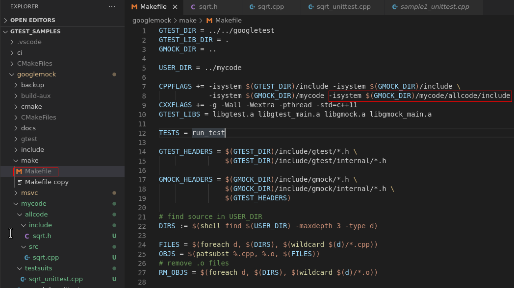
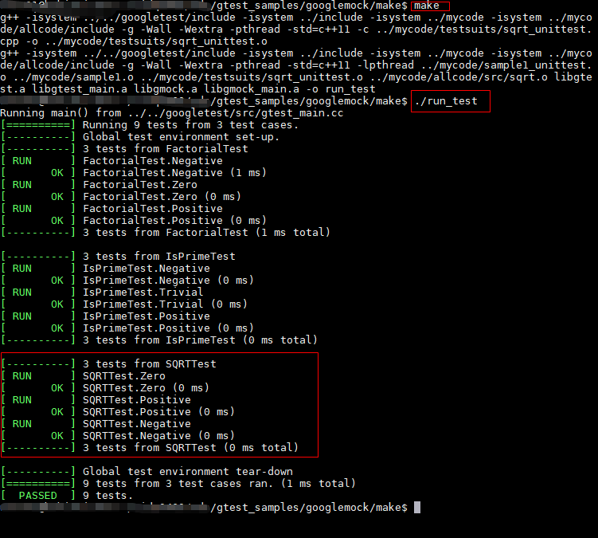

@[TOC](目录)

## 一、概述

前面搭建好了gtest和gmock的环境，并执行了原生的例子。

接下来开始进行实际使用。

本篇学习函数的测试。


## 二、准备待测代码

1. 创建目录

    在上篇创建的mycode路径下，创建allcode目录，用于存放所有待测代码，
里面再创建两个文件夹：
    - include   用于存放头文件
    - src       用于存放cpp源码文件

    在allcode同级目录下创建testsuits文件夹，用于存放测试套件（用例）文件
创建好的目录如下：

   

2. 编写待测代码和测试用例
   假设待测代码是一个开方函数，头文件如下：
   

   cpp文件如下：
   

   测试用例文件如下：
   


    至此待测源码准备完成。

## 三、修改Makefile文件

因为我们创建了目录和源码，makefile中的头文件路径要加上我们定义的路径，
修改如下：




所有Makefile的内容如下：
```c
GTEST_DIR = ../../googletest
GTEST_LIB_DIR = .
GMOCK_DIR = ..

USER_DIR = ../mycode

CPPFLAGS += -isystem $(GTEST_DIR)/include -isystem $(GMOCK_DIR)/include \
			-isystem $(GMOCK_DIR)/mycode -isystem $(GMOCK_DIR)/mycode/allcode/include
CXXFLAGS += -g -Wall -Wextra -pthread -std=c++11
GTEST_LIBS = libgtest.a libgtest_main.a libgmock.a libgmock_main.a

TESTS = run_test

GTEST_HEADERS = $(GTEST_DIR)/include/gtest/*.h \
                $(GTEST_DIR)/include/gtest/internal/*.h

GMOCK_HEADERS = $(GMOCK_DIR)/include/gmock/*.h \
                $(GMOCK_DIR)/include/gmock/internal/*.h \
                $(GTEST_HEADERS)

# find source in USER_DIR
DIRS := $(shell find $(USER_DIR) -maxdepth 3 -type d)

FILES = $(foreach d, $(DIRS), $(wildcard $(d)/*.cpp))
OBJS = $(patsubst %.cpp, %.o, $(FILES))
# remove .o files
RM_OBJS = $(foreach d, $(DIRS), $(wildcard $(d)/*.o))

all : $(GTEST_LIBS) $(TESTS)

clean :
	rm -f $(GTEST_LIBS) $(TESTS) *.o $(RM_OBJS)


GTEST_SRCS_ = $(GTEST_DIR)/src/*.cc $(GTEST_DIR)/src/*.h $(GTEST_HEADERS)
GMOCK_SRCS_ = $(GMOCK_DIR)/src/*.cc $(GMOCK_HEADERS)


gtest-all.o : $(GTEST_SRCS_)
	$(CXX) $(CPPFLAGS) -I$(GTEST_DIR) -I$(GMOCK_DIR) $(CXXFLAGS) \
            -c $(GTEST_DIR)/src/gtest-all.cc

gtest_main.o : $(GTEST_SRCS_)
	$(CXX) $(CPPFLAGS) -I$(GTEST_DIR) -I$(GMOCK_DIR) $(CXXFLAGS) \
            -c $(GTEST_DIR)/src/gtest_main.cc

gmock-all.o : $(GMOCK_SRCS_)
	$(CXX) $(CPPFLAGS) -I$(GTEST_DIR) -I$(GMOCK_DIR) $(CXXFLAGS) \
            -c $(GMOCK_DIR)/src/gmock-all.cc

gmock_main.o : $(GMOCK_SRCS_)
	$(CXX) $(CPPFLAGS) -I$(GTEST_DIR) -I$(GMOCK_DIR) $(CXXFLAGS) \
            -c $(GMOCK_DIR)/src/gmock_main.cc

libgtest.a : gtest-all.o
	$(AR) $(ARFLAGS) $@ $^

libgtest_main.a : gtest_main.o
	$(AR) $(ARFLAGS) $@ $^

libgmock.a : gmock-all.o
	$(AR) $(ARFLAGS) $@ $^

libgmock_main.a : gmock_main.o
	$(AR) $(ARFLAGS) $@ $^

# Builds a sample test for cpp code.
%.o : %.cpp
	$(CXX) $(CPPFLAGS) $(CXXFLAGS) -c $< -o $@

$(TESTS) : $(OBJS) $(GTEST_LIBS)
	$(CXX) $(CPPFLAGS) $(CXXFLAGS) -lpthread $^ -o $@

```


## 四、编译执行

cd 进入googletest-release-1.8.1/googlemock/make/ 目录
执行make命令进行编译和运行测试：

    make

    ./run_test

运行结果：




## 五、总结

单元测试用例设计方法主要有：
1. 等价类划分
2. 边界值
3. 错误推测 等。

代码覆盖方式主要有：
1. 语句覆盖
2. 分支覆盖（也叫判定覆盖）
3. 修订条件/判定覆盖
4. 多重条件覆盖 等


本例子可以看出，使用了等价类划分设计用例：
等价类划分：正值、0、负值

为了覆盖x = 1分支，
增加了测试用例

    TEST(SQRTTest, One)

从覆盖率上来说，这几个测试用例还没有达到指定的覆盖率，为达到指定的覆盖率，还需要设计更多的用例才行。


这个例子的源码暂时保存在git上使用如下命令即可下载：

    git clone git@github.com:TonsenWei/gtest_samples.git
    

或访问如下链接下载：
[gtest-demo](https://github.com/TonsenWei/gtest_samples/tree/V1.1.0)