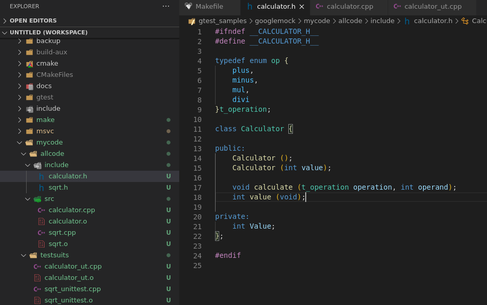
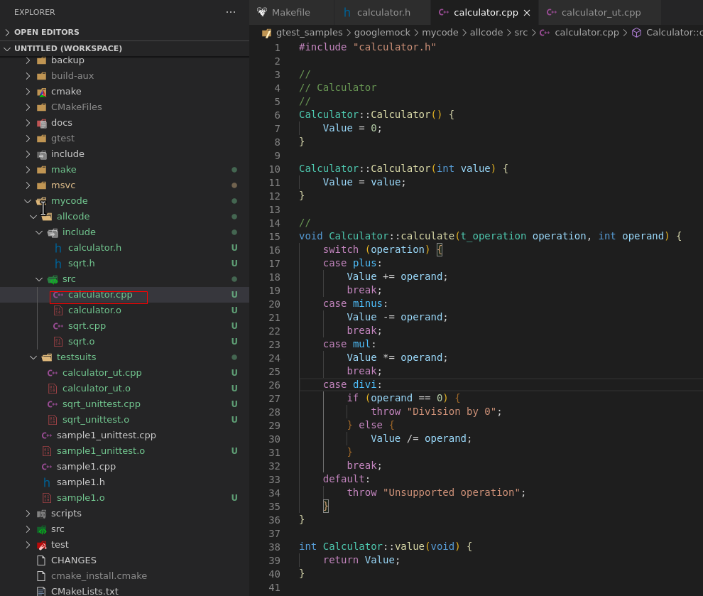
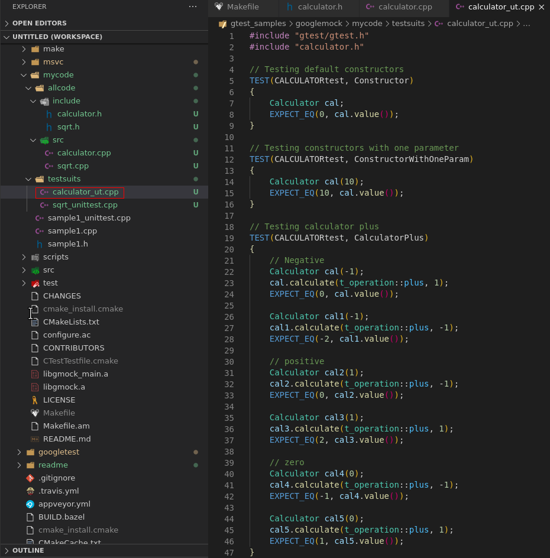
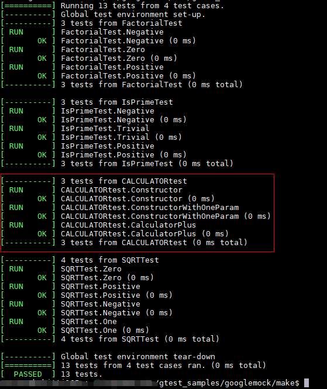
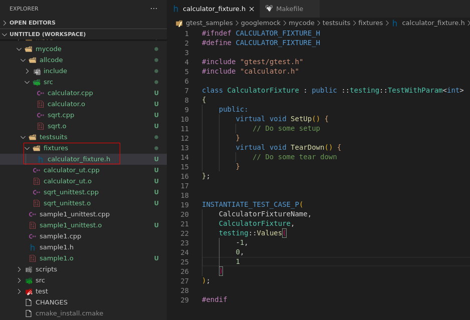
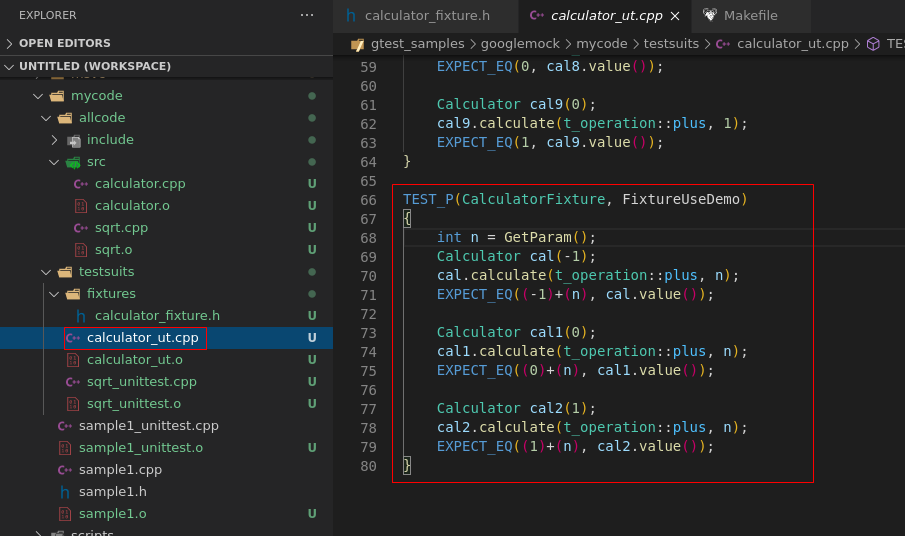
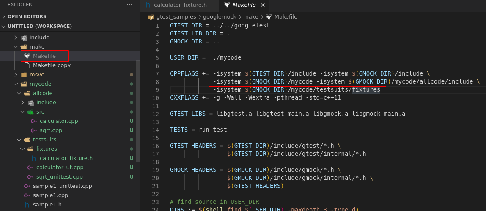
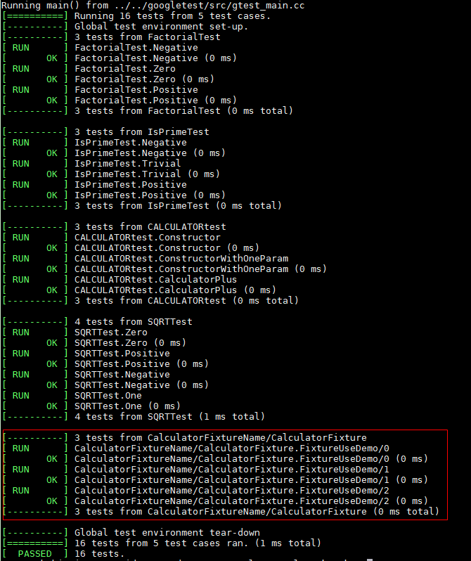
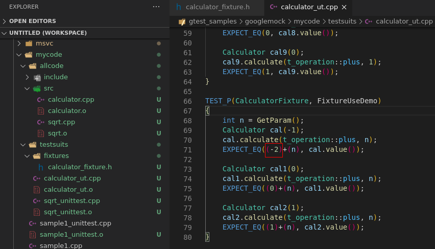
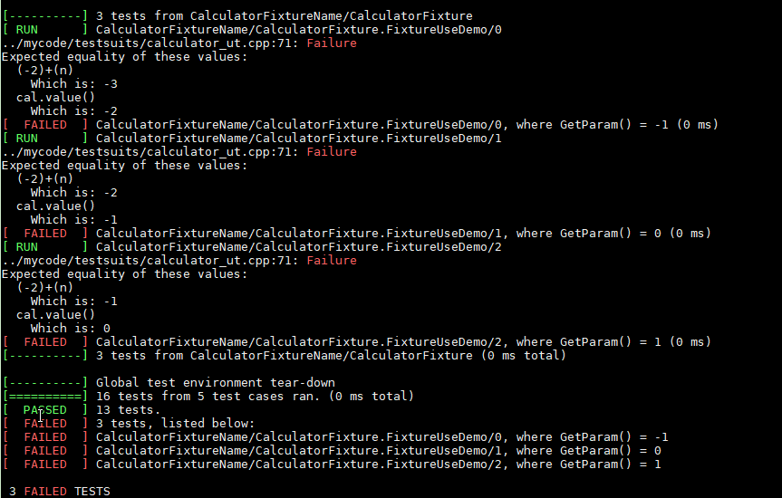

@[TOC](目录)

## 一、概述

本篇学习类的测试，并使用测试参数进行测试。


## 二、准备待测代码

待测源码是一个计算器类，接下来我们对这个类进行测试。

1. 增加待测源码头文件

   

2. 增加待测源码cpp文件
   
   

3. 增加测试用例文件如下：
   


    至此待测源码准备完成。

## 三、修改Makefile文件

因为我们只在已有的目录增加了原文件，没有创建新的目录和头文件，所以makefile可以不用修改。


## 四、编译执行

cd 进入googletest-release-1.8.1/googlemock/make/ 目录
执行make命令进行编译和运行测试：

    make

    ./run_test

运行结果：



可以看到我们的测试用例执行成功。


## 五、使用测试参数
上面的例子可以看到，在测试加法时，为了后面的加数是不同的值，现在因为使用等价类划分只有 -1， 0， 1三个值，如果是测试别的用例，需要测试几十，上百个值的时候，我们的测试代码会非常多，为了应对这个情况，可以使用谷歌提供的测试参数宏。简单使用方法如下：

1. 在testsuits目录创建一个fixtures文件夹，用于存放测试参数宏，或者以后的测试固件类。
2. 创建calculator_fixture.h头文件。头文件的内容如下：
   
可以看到，我们现在设置的值是-1， 0， 1，如果需要测试更多的值，可以直接在这个头文件里面增加，如增加-100，200，1000 ：

```c
INSTANTIATE_TEST_CASE_P(
    CalculatorFixtureName,
    CalculatorFixture,
    testing::Values(
        -1,
        0,
        1,
        -100,
        200,
        1000
    )
);
```


3. 增加使用测试参数的用例：
   在calculator_ut.cpp文件中增加如下用例：

    ```c
    TEST_P(CalculatorFixture, FixtureUseDemo)
    {
        int n = GetParam();
        Calculator cal(-1);
        cal.calculate(t_operation::plus, n);
        EXPECT_EQ((-1)+(n), cal.value());

        Calculator cal1(0);
        cal1.calculate(t_operation::plus, n);
        EXPECT_EQ((0)+(n), cal1.value());

        Calculator cal2(1);
        cal2.calculate(t_operation::plus, n);
        EXPECT_EQ((1)+(n), cal2.value());    
    }
    ```

   

4. 修改makefile
   因为我们增加了fixtures目录并在该目录添加了calculator_fixture.h头文件，所以我们需要修改makefile，使编译的时候能找到我们的头文件：

   

5. 编译并执行用例
    cd 进入googletest-release-1.8.1/googlemock/make/ 目录
执行make命令进行编译和运行测试：

    make

    ./run_test

6. 执行结果
   


7. 尝试让测试用例失败
   一路过滤我们写的用例都是pass的，我们可以尝试让用例失败，看看如果我们测试到bug，会怎么样。
   这里把使用参数测试的用例中的-1改为-2，这样期望的值肯定就跟预期的不一样了：
   

   重新编译执行，fail的结果就显示出来了：
   
   
## 六、总结

这次学习了使用gtest进行了如下测试：
1、对类的默认构造函数进行测试
2、对类的带参数的构造函数进行测试
3、对类的方法进行测试
4、使用测试参数进行测试，简化用例编写


这个例子的源码暂时保存在git上使用如下命令即可下载：

    git clone git@github.com:TonsenWei/gtest_samples.git
    

或访问如下链接下载：
[gtest-demo](https://github.com/TonsenWei/gtest_samples/tree/V1.1.1)